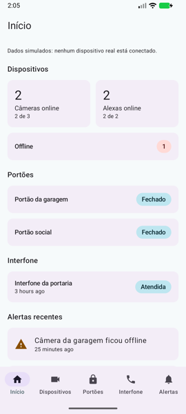
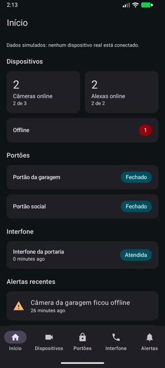
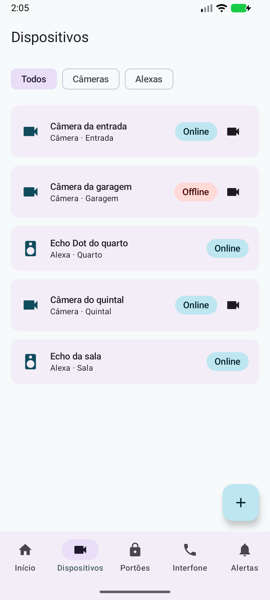
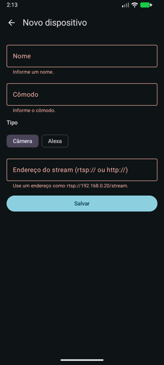
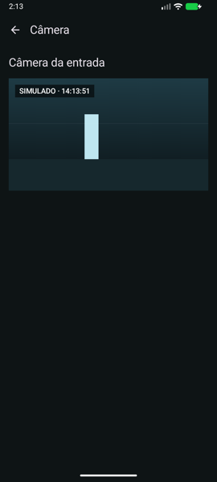
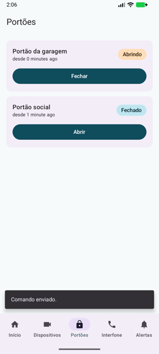
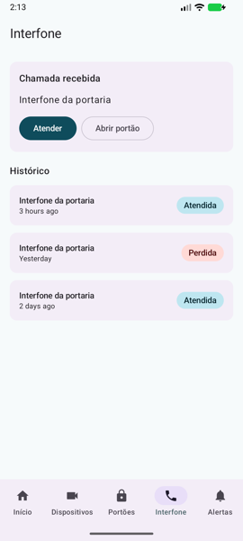
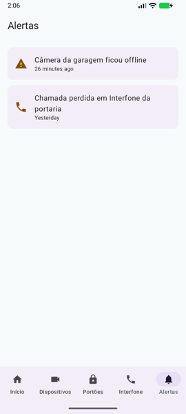
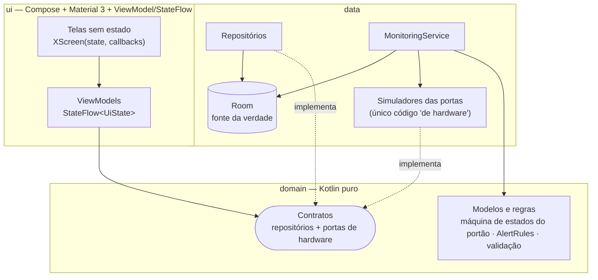
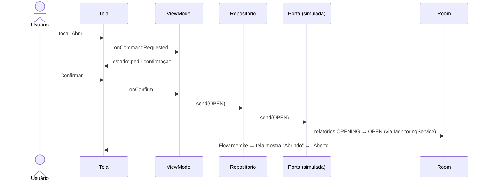

# android-home-monitor

[](https://github.com/andreccls/android-home-monitor/actions/workflows/ci.yml)
[](https://kotlinlang.org/)
[](https://developer.android.com/jetpack/compose)
[](gradle/libs.versions.toml)
[](docs/TESTING.md#cobertura-kover-linhas-dos-testes-unitários)
[](docs/TESTING.md)
[](LICENSE)

> ⚠️ **PROJETO DE EXEMPLO DE CÓDIGO (reference / sample) — NÃO É UM PRODUTO PRONTO PARA PRODUÇÃO.**
> Existe para demonstrar a **arquitetura de referência do Google para Android** (UI / domain / data, fluxo unidirecional, Room offline-first)
> com Jetpack Compose, testes e documentação. **Nada aqui fala com câmeras, Alexas, portões ou interfones reais:** todos os dispositivos são
> **simulados** (estados que mudam com o tempo, latência e falhas ocasionais) atrás de interfaces. Os dados são fictícios, não há autenticação
> e a "transmissão" da câmera é um quadro desenhado pelo app. A lista honesta do que falta está em [Limitações](#limitações-conhecidas).

> 🇬🇧 English summary: [README.en.md](README.en.md).

## O que é

App Android (Kotlin) de **monitoramento residencial**:

- **Cadastro** de câmeras e Alexas (Echo): nome, cômodo, tipo, endereço/identificador e status online/offline (CRUD com validação).
- **Portões**: estado (fechado, abrindo, aberto, fechando, offline) e comandos abrir/fechar **sempre com confirmação**.
- **Interfone**: chamada recebida/atendida/perdida, histórico, e "atender" / "abrir portão" a partir da chamada.
- **Painel inicial**: visão geral dos dispositivos, portões, última chamada e **alertas** (portão aberto há muito tempo, dispositivo offline, chamada perdida).
- **Visualização da câmera**: transmissão **simulada** (quadros gerados).

Desenhado com **SOLID, KISS e YAGNI**: módulo único com pacotes separados, sem multi-módulo, sem WorkManager, sem Navigation 3, sem biblioteca de ícones
estendida — cada escolha está num [ADR](docs/adr).

## Telas

Capturas reais do app rodando no emulador (Medium Phone, API 37), geradas com `adb exec-out screencap`. Tema claro e escuro seguem o sistema.

| | | | |
|---|---|---|---|
| <br/>**Início** | <br/>**Início**, escuro | <br/>**Dispositivos** (câmeras e Alexas) | <br/>**Cadastro** com erros |
| <br/>**Câmera** simulada | <br/>**Portões**: "Abrindo" após confirmar | <br/>**Interfone** tocando | <br/>**Alertas** |

## Arquitetura

Segue o [Guide to app architecture](https://developer.android.com/topic/architecture) do Google. Detalhes, estrutura de pacotes e o passo a passo para
**adicionar um novo tipo de dispositivo** em [docs/ARCHITECTURE.md](docs/ARCHITECTURE.md).



**Fluxo unidirecional (UDF):** o estado desce (Room → repositório `Flow` → ViewModel `StateFlow` → tela), os eventos sobem (toque → método do ViewModel →
repositório → porta). O comando "abrir portão" **não** altera o banco; a confirmação volta pela porta e é gravada pelo `MonitoringService`.



Regra de dependência `ui → domain ← data`, verificada por **teste de arquitetura (Konsist)**: `domain` não importa Android, `data` não conhece `ui`, `ui` não importa `data`.

## Como buildar, rodar e testar

Requisitos: **JDK 17+** (o `Makefile` usa o JDK do Android Studio no macOS se `JAVA_HOME` não estiver definido), **Android SDK** com plataforma 37 e build-tools 36.0.0.
Informe o SDK com `ANDROID_HOME` ou crie `local.properties` (**não é versionado**) com `sdk.dir=/caminho/do/Android/sdk`.

```bash
make build         # APK debug
make test          # testes unitários (JVM)
make lint          # ktlint + Android Lint
make coverage      # testes + Kover (gate de 80 %) + tabela por camada
make instrumented  # testes de UI no emulador/dispositivo conectado
make run           # instala e abre no emulador/dispositivo
make format        # ktlint -F
```

O Gradle Wrapper (9.8.0, SHA-256 da distribuição fixado) baixa tudo na primeira execução. Emulador headless:
`$ANDROID_HOME/emulator/emulator -avd <nome> -no-window -no-audio -gpu swiftshader_indirect`.

## Decisões técnicas

| Decisão | Escolha | Por quê |
|---|---|---|
| Arquitetura | UI / domain / data + UDF, módulo único | regras puras e testáveis; multi-módulo não se paga neste tamanho — [ADR 0001](docs/adr/0001-google-app-architecture-udf.md) |
| Persistência | Room como fonte da verdade, repositórios expõem `Flow` | abre com o último estado, UI consistente — [ADR 0002](docs/adr/0002-room-offline-first.md) |
| DI | Hilt (+ KSP) | `@HiltViewModel` e `@TestInstallIn` valeram; sem atrito com AGP 9 — [ADR 0003](docs/adr/0003-hilt-vs-manual-di.md) |
| Dispositivos | simulados atrás de 4 portas (`GateDriver`, `IntercomDriver`, `DeviceProbe`, `CameraStream`) | trocar por hardware real = implementar interfaces — [ADR 0004](docs/adr/0004-simulated-devices-behind-ports.md) |
| Testes | JUnit 4 + fakes + Turbine + Robolectric (Room) + Compose no emulador + Konsist | pirâmide rápida, UI verificada de verdade — [ADR 0005](docs/adr/0005-testing-strategy.md) |
| UI | Compose + Material 3, paleta fixa (sem cor dinâmica) | aparência igual em qualquer aparelho |
| Navegação | Navigation Compose (rotas por string) | suficiente para 7 destinos |
| Ícones | `material-icons-core` + 2 vetores próprios | evita a biblioteca estendida inteira |

### Versões (todas estáveis, as mais recentes compatíveis em 2026-10-06)

AGP **9.4.1** · Gradle **9.8.0** · Kotlin **2.4.20** · KSP 2.3.12 · Compose BOM **2026.09.00** · Room 2.8.5 · Hilt 2.60.1 · Navigation Compose 2.10.2 ·
Lifecycle 2.11.0 · Coroutines 1.11.0 · compileSdk/targetSdk **37**, minSdk **26** · JDK de build: **25** (JBR do Android Studio), bytecode para Java 17.
Tudo no [version catalog](gradle/libs.versions.toml). O CI usa JDK 21 (Temurin).

## Testes e qualidade

Medido em 2026-10-06 (detalhes e exclusões em [docs/TESTING.md](docs/TESTING.md)):

| Verificação | Resultado |
|---|---|
| Testes unitários (JVM) | **66 verdes** (domínio 13 · simuladores 12 · Room/repositórios 7 · monitoramento 8 · ViewModels 20 · arquitetura 6) |
| Testes de UI instrumentados (emulador API 37) | **7 verdes** — cadastrar câmera, cadastrar Alexa, erros do formulário, portão com confirmação, atender interfone, alertas, alvo de toque ≥ 48 dp |
| Cobertura de linhas (Kover) | `data` **100 %** (282/282) · `domain` **100 %** (88/88) · ViewModels **100 %** (174/174); branches 94,1 %; **gate: ≥ 80 %** |
| Lint | ktlint sem violações · Android Lint limpo com avisos como erro · Kotlin com `allWarningsAsErrors` |
| Build | `assembleDebug` e `assembleRelease` (R8, sem assinatura) ok |
| Execução no emulador | sem `FATAL` no logcat; telas verificadas visualmente (screenshots acima), tema claro e escuro |
| Clone limpo | build + testes unitários + lint passam num clone sem `local.properties` nem `build/` |

Cobertura **exclui** telas Compose, tema, navegação, módulos Hilt e código gerado (cobertos por testes instrumentados/screenshots, que o Kover não mede) — lista completa e justificativa em docs/TESTING.md.
Os testes instrumentados **não rodam no CI** (precisam de emulador; lentos e instáveis em runner hospedado) — rode `make instrumented`.

## Limitações conhecidas

- **Nada fala com hardware real.** Câmeras, Alexas, portões e interfones são simulados (`data/simulation`). O comportamento do simulador é uma hipótese; protocolos reais terão falhas que ele não imita.
- **"Transmissão" da câmera é desenhada**, não é vídeo; não há RTSP, áudio nem gravação.
- **Cadastrar uma Alexa só cria um registro** (nome, cômodo, série, status sondado pelo simulador); nenhuma habilidade/ação da Alexa existe.
- **Sem autenticação, usuários nem rede/nuvem**; o estado vive só no aparelho. Sem backup (`allowBackup=false`).
- **Monitoramento só enquanto o app está vivo.** O `MonitoringService` roda no escopo da aplicação; não há serviço em primeiro plano, WorkManager nem notificações push de alertas.
- **Alertas** ficam só na lista (sem notificação do sistema, sem marcar como lido/dispensar, sem limite de retenção).
- **Textos relativos ("há 3 horas")** seguem o idioma do sistema; UI só em português (sem `values-en`). Em aparelho em inglês, mistura os idiomas.
- **Sem migrações de banco** (versão 1 do esquema). Seed de demonstração entra uma vez na criação do banco.
- **Não exercitado:** TalkBack em dispositivo real, contraste medido por ferramenta, telas grandes/tablet (layout não é adaptativo), orientação paisagem, `assembleRelease` assinado/instalado, o workflow de CI no GitHub (ainda não rodou lá) e JDK 21 localmente (o build local foi feito com JDK 25).
- Dados de amostra (`DemoSeed`) e nomes são fictícios.

## Próximos passos (integração real, **não implementada** por YAGNI)

- **Câmeras:** RTSP (ex.: Media3/ExoPlayer com `RtspMediaSource`) e/ou **ONVIF** para descoberta e perfis; implementar `CameraStream` com vídeo real e `DeviceProbe` com sondagem de rede.
- **Alexa:** **Alexa Smart Home Skill API** / Alexa Voice Service (OAuth2 por LWA, eventos de estado) em vez de apenas cadastrar o Echo.
- **Portões e interfones:** o que o fabricante expuser — MQTT, REST local, relé via ESP32/Home Assistant, SIP para o interfone — implementando `GateDriver` e `IntercomDriver`.
- **Segundo plano e notificações:** serviço em primeiro plano ou WorkManager + notificações para os alertas; FCM se houver nuvem.
- **Segurança:** autenticação, armazenamento seguro de credenciais dos dispositivos (Keystore), TLS e confirmação biométrica para abrir portão.
- **UX:** layout adaptativo, localização (en), dispensar alertas, edição de nome/cômodo de portões.
- **Build:** multi-módulo se o app crescer; CI com emulador (gerenciado) para os instrumentados.

## Documentação

[docs/ARCHITECTURE.md](docs/ARCHITECTURE.md) · [docs/TESTING.md](docs/TESTING.md) · ADRs:
[0001 arquitetura do Google e UDF](docs/adr/0001-google-app-architecture-udf.md) ·
[0002 Room offline-first](docs/adr/0002-room-offline-first.md) ·
[0003 Hilt](docs/adr/0003-hilt-vs-manual-di.md) ·
[0004 dispositivos simulados atrás de portas](docs/adr/0004-simulated-devices-behind-ports.md) ·
[0005 estratégia de testes](docs/adr/0005-testing-strategy.md)

## Licença

[MIT](LICENSE) © André Coura
