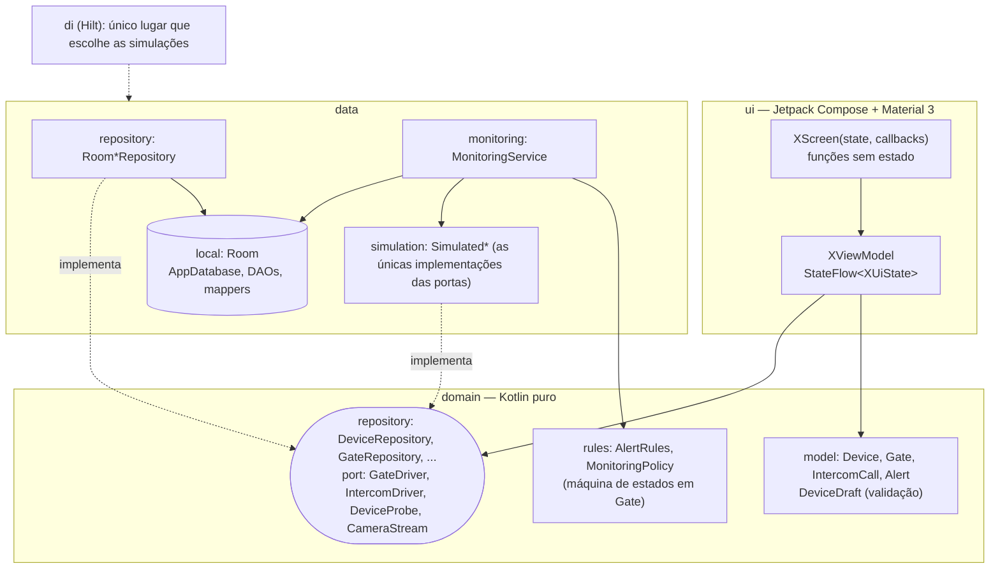
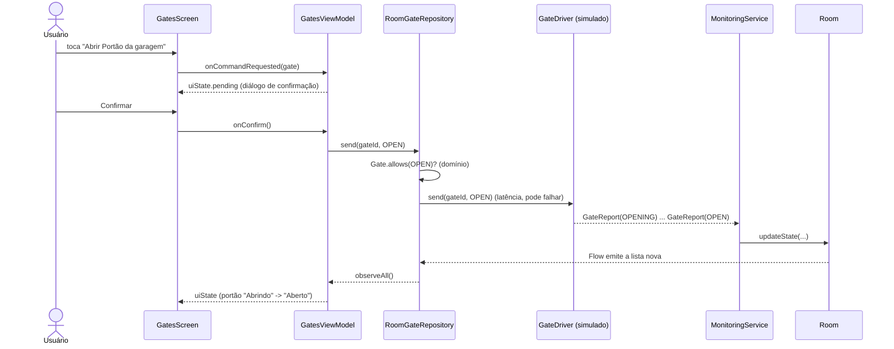

# Arquitetura

Segue o [Guide to app architecture](https://developer.android.com/topic/architecture) do Google (decisão em [ADR 0001](adr/0001-google-app-architecture-udf.md)):
camadas **ui / domain / data**, fluxo de dados **unidirecional** e **Room como fonte da verdade**.

> Nada aqui conversa com câmeras, Alexas, portões ou interfones reais. Toda a "casa" é simulada atrás de portas
> ([ADR 0004](adr/0004-simulated-devices-behind-ports.md)).

## Camadas e regra de dependência



`ui → domain ← data`: `domain` não importa Android; `data` não conhece `ui`; `ui` não importa `data` (só interfaces de `domain`).
O `ArchitectureTest` (Konsist) falha o build se isso for violado.

## Estrutura de pacotes

```
app/src/main/kotlin/com/andrecoura/homemonitor/
├── HomeMonitorApp.kt, MainActivity.kt      # entrada: inicia o MonitoringService; edge-to-edge + tema
├── domain/
│   ├── model/        Device, DeviceDraft, Gate (+ máquina de estados), IntercomCall, Alert, CameraFrame
│   ├── rules/        AlertRules (funções puras), MonitoringPolicy
│   ├── repository/   interfaces que a UI consome
│   └── port/         interfaces do "hardware" + exceções do contrato
├── data/
│   ├── local/        Room: entidades, DAOs, mapeadores, DemoSeed
│   ├── repository/   Room*Repository (Flow sobre o Room)
│   ├── monitoring/   MonitoringService: escuta as portas -> grava no Room -> gera alertas
│   └── simulation/   SimulatedGateDriver, ...IntercomDriver, ...DeviceProbe, ...CameraStream, SimulationConfig
├── di/               módulos Hilt (banco, repositórios, simulação, portas)
└── ui/
    ├── home, devices, gates, intercom, alerts   # por funcionalidade: XViewModel + XScreen (+ XRoute)
    ├── components/   peças reutilizáveis (chips, cartões, diálogo de confirmação)
    ├── navigation/   Navigation Compose + barra inferior
    └── theme/        paleta Material 3 (clara/escura), ícones extras
```

## Fluxo de dados (UDF)

Exemplo: o usuário abre um portão.



Pontos importantes:

- A UI **nunca** altera o estado do portão: ela pede; quem manda no estado é o que o portão reporta (gravado pelo `MonitoringService`).
- Mensagens ("comando enviado", "o portão não respondeu") são **estado** em `GatesUiState.message`, consumidas por `onMessageShown()`.
- O alerta "portão aberto há muito tempo" é uma regra pura (`AlertRules.gateLeftOpen`) avaliada periodicamente pelo serviço sobre o que está no Room.

## Como adicionar um novo tipo de dispositivo

Exemplo: **sensor de porta** (aberto/fechado, com alerta de "aberto há muito tempo").

1. **Domínio.** Crie `domain/model/DoorSensor.kt` (estado + regras que dependem só dele). Se gera alerta, adicione o valor em `AlertType` e uma função em `AlertRules` com teste em `DomainTest`.
2. **Porta.** Em `domain/port/Ports.kt`, declare `interface DoorSensorDriver { fun observe(): Flow<SensorReport> }`. Descreva no KDoc o que pode falhar.
3. **Repositório.** Em `domain/repository/Repositories.kt`, declare `DoorSensorRepository` (o que a UI precisa: `observeAll()`).
4. **Persistência.** Em `data/local`, adicione `DoorSensorEntity` + DAO, registre em `AppDatabase` (suba `version` e exporte o esquema; escreva a migração) e crie os mapeadores.
5. **Implementação.** `data/repository/RoomDoorSensorRepository` e, em `data/simulation`, `SimulatedDoorSensorDriver` (receba `SimulationConfig`, `Clock`, `Random` para ser testável com tempo virtual).
6. **Monitoramento.** No `MonitoringService`, colete `driver.observe()` e grave no Room (e gere alertas pelas regras).
7. **DI.** Em `di/Modules.kt`: `@Binds` do repositório e `@Provides` do driver simulado.
8. **UI.** Crie `ui/doorsensors/` com `DoorSensorsViewModel` (+ `UiState`) e `DoorSensorsScreen` sem estado; adicione a rota em `ui/navigation` (e o texto em `strings.xml`).
9. **Testes.** Fakes em `support/Fakes.kt`, testes do ViewModel, do repositório (Room em memória), do simulador e, se houver fluxo novo, um caso em `AppFlowTest`.
   `ArchitectureTest` já cobre a regra de dependência dos novos arquivos.

Se o novo tipo é **cadastrado pelo usuário** (como câmera/Alexa), basta um novo valor em `DeviceKind`, a regra de endereço em `DeviceDraft` e o ícone/texto na UI — o CRUD e a sondagem de status já funcionam para qualquer `DeviceKind`.

## Concorrência

- `MonitoringService` roda no `ApplicationScope` (`SupervisorJob` + `Dispatchers.Default`) com 4 corrotinas: portões, interfone, sondagem de dispositivos (recomeça ao cadastrar/alterar endereço) e vigia de portão aberto.
- Room executa consultas fora da thread principal; `Flow`s do Room reemitem a cada mudança.
- ViewModels expõem `StateFlow` com `stateIn(WhileSubscribed(5s))`: param de coletar 5 s depois que a tela sai.
